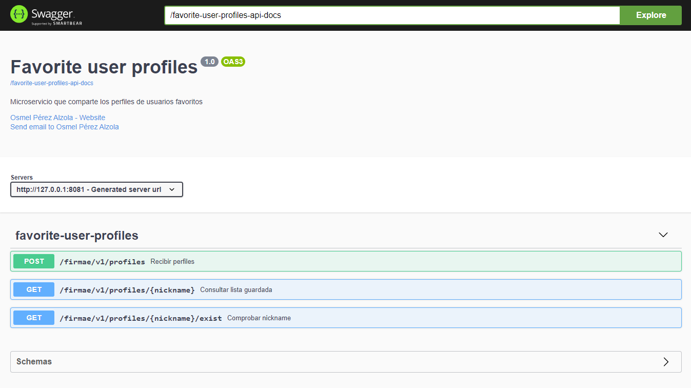
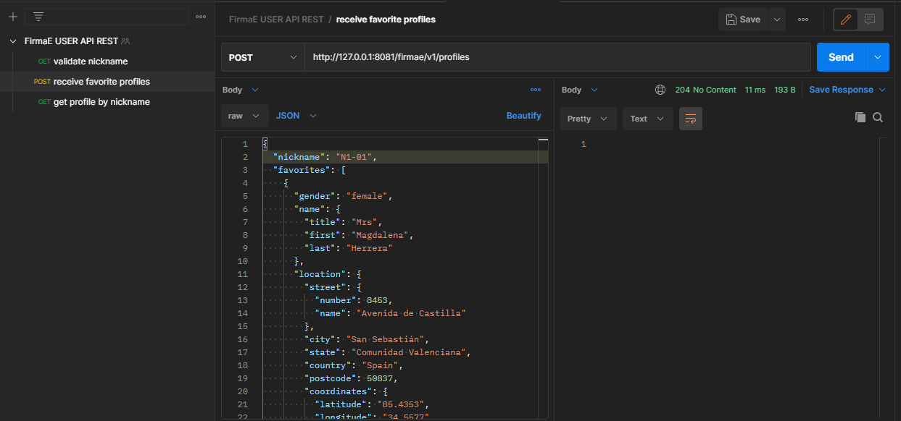
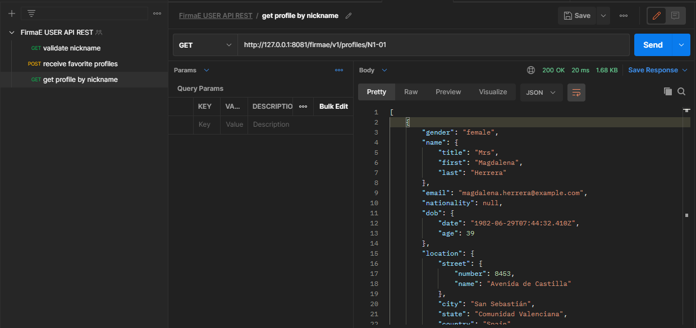
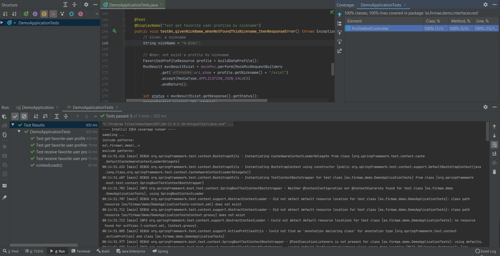

# favorite-user-profiles-backend
En este ejercicio se desarrolló un servicio para compartir perfiles de usuarios favoritos, los cuales se almacenan en memoria usando `H2` junto con su nickname, para que luego puedan ser consultados por un nickname. Se documentó la API REST con `Open API Swagger` y los endpoints fueron probados con `Postman`,  adicionalmente se implementaron pruebas automatizadas con `JUnit` para corroborar el correcto funcionamiento del microservicio.

# FAVORITE USER PROFILES
En este ejercicio se desarrolló un servicio para compartir perfiles de usuarios favoritos,
los cuales se almacenan en memoria usando `H2` junto con su nickname, para que luego puedan ser consultados por un nickname. 

Se documentó la API REST con `Open API Swagger` y los endpoints fueron probados con `Postman`, 
adicionalmente se implementaron pruebas automatizadas con `JUnit` para corroborar el correcto funcionamiento del microservicio.

Se aplicó una arquitectura basada en `Domain Driver Design` y se aplicaron patrones como Adapter, Repositorios entre otros. 
Para un mejor rendimiento de la api dado el volumen de datos manejados se habilitó la compresión `gzip` y `HTTP2`;
 y se persistieron los datos en memoria como json para minimizar el número de consultas sobre los datos.

La documentación de la api se encontrará disponible en: `http://127.0.0.1:8081/favorite-user-profiles-swagger-docs`

## Despliegue
1. Como IDE de desarrollo se emplea `Intellij IDEA`. Descargar [aquí](https://www.jetbrains.com/es-es/idea/download/).
     - Instalar en el IDE el plugin `Lombok`. Para Intellij descargar [aquí](https://plugins.jetbrains.com/plugin/6317-lombok/). 
   
2. Para gestionar las dependencia se emplea `MAVEN`. Descargar [aquí](https://maven.apache.org/download.cgi/).

    - El `pom/xml` contiene todas las dependencias que deben ser descargadas para el despliegue de este proyecto.
      
3. Para la persistencia en memoria se emplea `H2`. 
    - Descargar para Windows [aquí](https://h2database.com/h2-setup-2019-03-13.exe)
    - Descargar para Linux [aquí](https://h2database.com/h2-2019-03-13.zip). Puede seguir esta guía [aquí](https://o7planning.org/11895/install-h2-database-and-use-h2-console)
    - Puede modificar la configuración de H2 como nombre de la base de datos, puerto y host mediante el `aplication.properties`

4. `Postman` para probar los endpoint de las APIs. Descargar [aquí](https://www.postman.com/downloads/).
       
5. Clonar el proyecto desde: 
    https://github.com/osmelpa/FavoriteUserProfiles_Microservice.git

## Restricciones y endpoints
En la carpeta `readme` adjunta en el proyecto se encuentra el archivo `RANDOM USER API REST.postman_collection.json` el cual contiene los endpoints desarrollados,
los cuales puede ser importado en Postman.

El ejercicio consta de 2 endpoints fundamentales. 

Endpoint #1 Recibir listado de perfiles de los usuarios favoritos.
 - POST /firmae/v1/profiles
 - Ejemplo: http://127.0.0.1:8081/firmae/v1/profiles
   Se especifica por Body el listado, retorna 204 status porque no devuelve contenido, el listado se recibe y se almacena en memoria.
   
 - Vista de una solicitud realizada por postman
 
 
 
Endpoint #2 Consultar la lista guardada con el listado de usuarios favoritos por el nickname del perfil creado por el usuario.
 - GET /firmae/v1/profiles/{nickname}
 - Ejemplo: http://127.0.0.1:8081/firmae/v1/profiles/N1-01
   Se especifica por PathVariable el nickname del perfil deseado, retorna 200 status porque devuelve el listado de usuarios favoritos que se corresponden al nickname del perfil especificado de forma satisfactoria.
    
 - Vista de una solicitud realizada por postman
 
  

## Archivos y clases fundamentales
- El archivo `application.properties` contiene las configuraciones del proyecto como puerto, perisitencia en memoria con H2, configuraciones de compresión gzip y http2 y ruta para la documentación.
- La clase `URIConstant` centraliza las URI del proyecto para favorecer la reutilización.
- La clase `SwaggerDocumentation` almacenan los propeties de la documentación de la api y así simplificar la clase controladora.
- La clase `ProfileRestController` es la API REST del ejercicio que gestiona el manejo de los permiles con el listado de usuarios favoritos.
- La clase `FavoritesProfileListAdapter` es el adaptador que en DDD se encarga del mapeo de recursos a entidades del dominio.
- La clase `FavoritesProfileService` es el servicio que desarrolla la lógica y comunicación con el repositorio para la persistencia.
- La clase `FavoritesProfileRepository` es el repositorio para la persistencia en memoria, usando H2 y JPA.

## Testing
La implementación de las pruebas automatizadas se encuentran en la carpeta `test` del proyecto.

